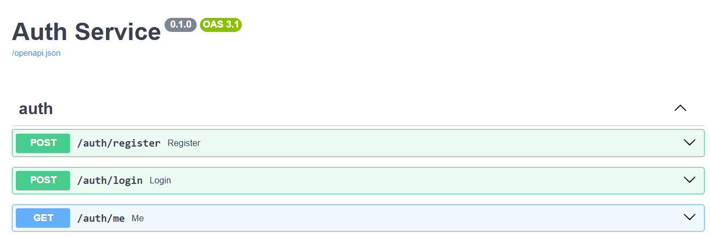
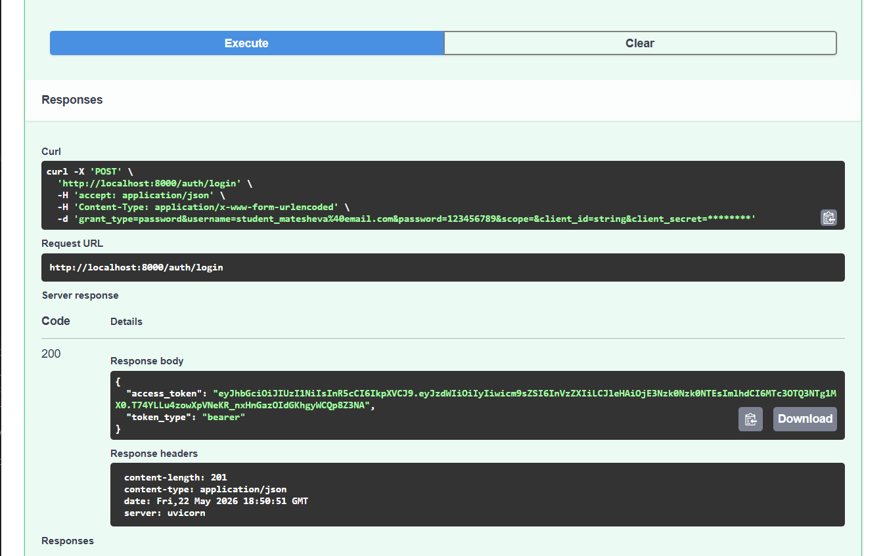
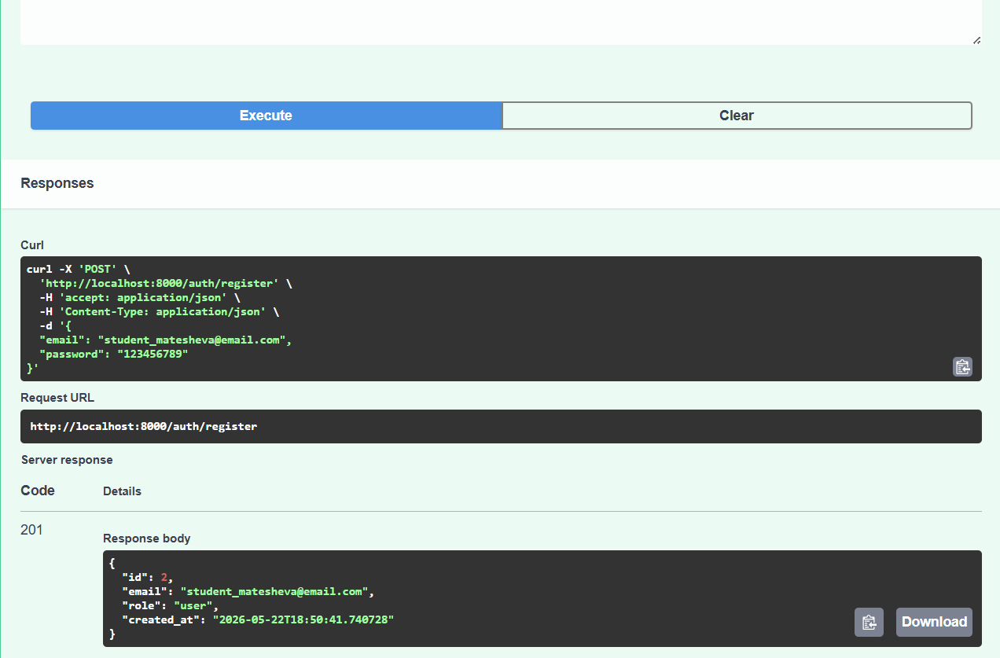
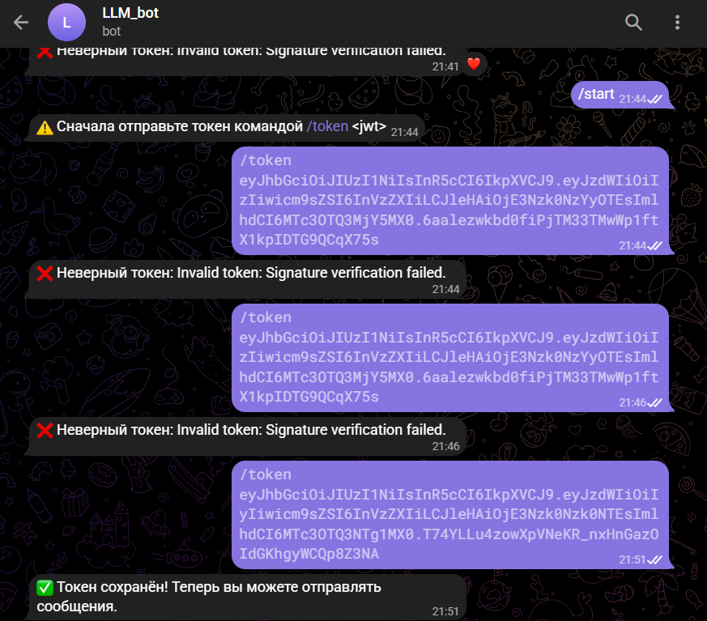
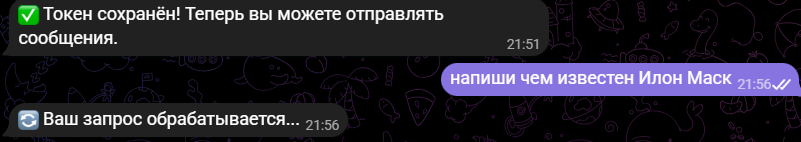
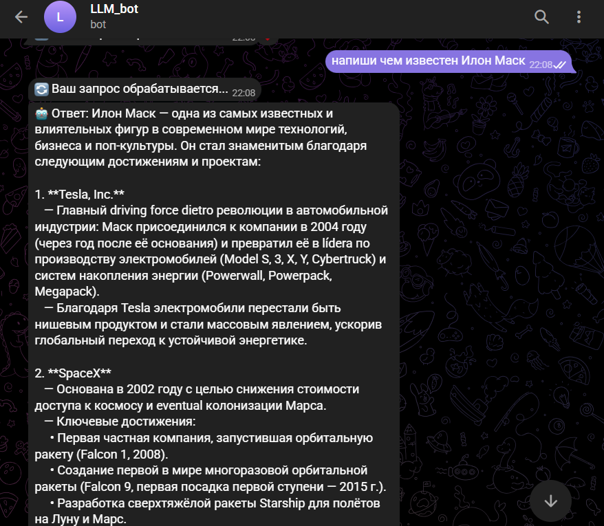
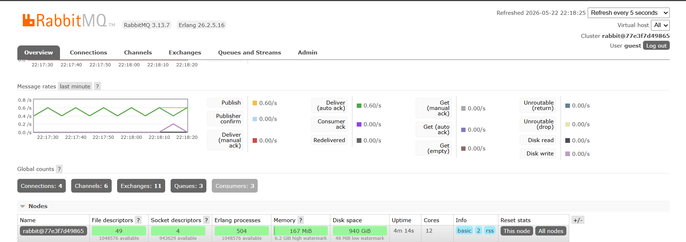
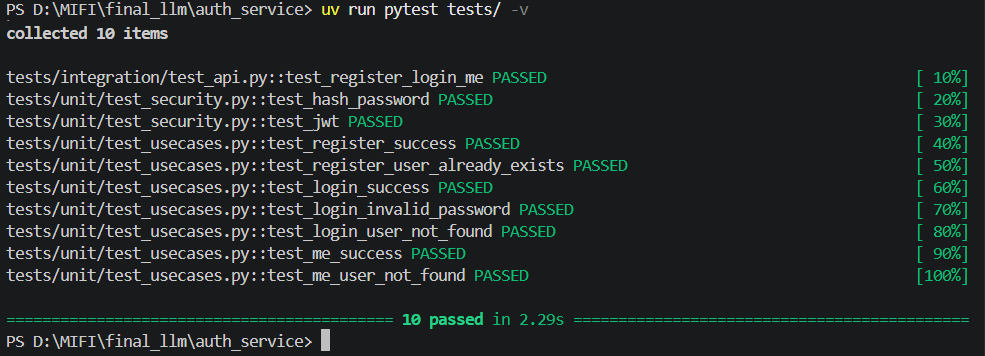
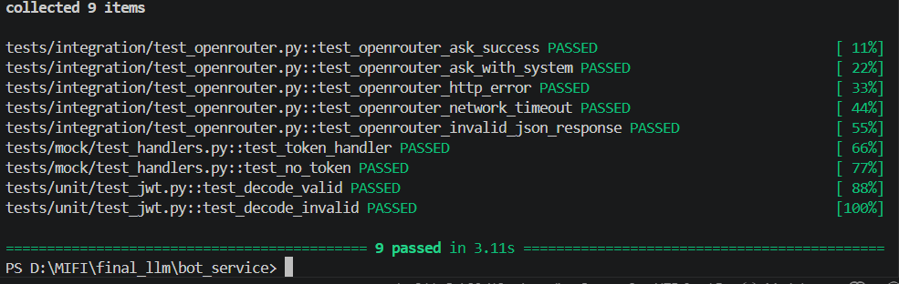

# Двухсервисная система LLM-консультаций

Проект представляет собой распределённую систему, состоящую из двух независимых сервисов: **Auth Service** (аутентификация и выдача JWT) и **Bot Service** (Telegram-бот для общения с LLM через OpenRouter). Система построена по принципу микросервисной архитектуры с асинхронной обработкой запросов через очередь задач.

## Архитектура

```
                                    ┌─────────────────────────────┐
                                    │       OpenRouter API        │
                                    │    (LLM: GPT / Phi / etc)   │
                                    └──────────────▲──────────────┘
                                                   │
┌─────────────┐       ┌─────────────┐      ┌───────┴───────┐
│  Пользователь│       │ Auth Service│      │  Bot Service │
│             │────▶  │  (FastAPI)  │      │  (aiogram)   │
│  (Swagger)  │       │ :8000       │      │  :8001       │
└─────────────┘       └──────┬──────┘      └───────┬──────┘
                             │                     │
                      ┌──────▼──────┐        ┌─────▼─────┐
                      │   SQLite    │        │   Redis   │
                      │  (users.db) │        │ JWT cache │
                      └─────────────┘        └─────┬─────┘
                                                    │
                                             ┌──────▼──────┐
                                             │  RabbitMQ   │
                                             │  (broker)   │
                                             └──────┬──────┘
                                                    │
                                             ┌──────▼──────┐
                                             │ Celery      │
                                             │ Worker      │
                                             └──────┬──────┘
                                                    │
                                                    ▼
                                             (отправка ответа
                                              через бота)
```

### Компоненты системы

| Компонент | Технология | Назначение |
|-----------|------------|-------------|
| **Auth Service** | FastAPI + SQLite | Регистрация пользователей, выдача и валидация JWT |
| **Bot Service** | aiogram + FastAPI | Telegram-бот, проверка JWT, приём сообщений |
| **RabbitMQ** | RabbitMQ | Брокер сообщений для очереди задач Celery |
| **Redis** | Redis | Хранение JWT (привязка к Telegram ID) и результат backend Celery |
| **Celery Worker** | Celery | Асинхронная обработка запросов к LLM через OpenRouter |
| **OpenRouter** | внешний API | Прокси к LLM (поддерживаются модели GPT, Claude, Gemini и др.) |

### Поток данных

1. **Регистрация** – пользователь создаёт учётную запись в Auth Service (через Swagger).
2. **Логин** – пользователь получает JWT-токен.
3. **Привязка токена в Telegram** – пользователь отправляет боту команду `/token <JWT>`. Бот сохраняет токен в Redis (ключ `token:<telegram_id>`).
4. **Запрос к LLM** – пользователь пишет текстовое сообщение. Бот:
   - проверяет наличие токена в Redis;
   - валидирует JWT (подпись, срок действия);
   - публикует задачу `llm_request` в RabbitMQ (через Celery).
5. **Асинхронная обработка** – Celery-воркер забирает задачу, вызывает OpenRouter, получает ответ и отправляет сообщение пользователю через Telegram Bot API.
6. **Ответ пользователю** – бот получает ответ от LLM и показывает его в чате.

## Назначение сервисов

### Auth Service
- **Хранилище пользователей:** email (уникальный), хеш пароля, роль, дата создания.
- **Эндпоинты:**
  - `POST /auth/register` – создание пользователя.
  - `POST /auth/login` – аутентификация (OAuth2 form-data), возвращает JWT.
  - `GET /auth/me` – получение профиля по валидному JWT.
- **Безопасность:** пароли хешируются bcrypt, JWT подписывается HS256.
- **База данных:** по умолчанию SQLite (`auth.db`), но можно заменить на PostgreSQL.

### Bot Service
- **Telegram-бот:** обработчик команд и сообщений.
- **Валидация JWT:** проверяет подпись и срок действия без обращения к Auth Service.
- **Кэширование токенов:** Redis (связь `telegram_id` → JWT).
- **Публикация задач:** Celery producer.
- **Health check:** FastAPI эндпоинт `/health` на порту 8001.

### RabbitMQ
- Брокер задач Celery. Очередь `celery` хранит отложенные запросы к LLM.

### Redis
- Хранилище JWT (чтобы бот не требовал токен при каждом сообщении).
- Backend для хранения результатов Celery (опционально).

### Celery Worker
- Выполняет `llm_request.delay()`.
- Вызывает `OpenRouterClient.ask()`.
- Отправляет ответ обратно в Telegram (прямо из воркера, используя `bot.send_message`).

## Сценарий работы

### Шаг 1. Запуск инфраструктуры
```bash
docker-compose up --build
```
Будут запущены: Auth Service (порт 8000), Bot Service (8001), RabbitMQ (5672, 15672), Redis (6379), Celery worker.

### Шаг 2. Регистрация и получение токена
Откройте Swagger Auth Service: [http://localhost:8000/docs](http://localhost:8000/docs)

1. **POST /auth/register**  
   ```json
   {
     "email": "student_ivanov@email.com",
     "password": "strongpassword"
   }
   ```
2. **POST /auth/login** (OAuth2 form)  
   - `username`: student_ivanov@email.com  
   - `password`: strongpassword  
   Скопируйте полученный `access_token`.

### Шаг 3. Привязка токена в Telegram
Найдите в Telegram вашего бота. Отправьте ему:
```
/token "полученный `access_token`"
```
Бот ответит: `✅ Токен сохранён! Теперь вы можете отправлять сообщения.`

### Шаг 4. Общение с LLM
Отправьте боту любое текстовое сообщение, например:  
`"Расскажи кратко о принципах микросервисной архитектуры"`  
Бот сначала ответит: `🔄 Ваш запрос обрабатывается...`, а через несколько секунд получите ответ от LLM.

### Шаг 5. Проверка очередей RabbitMQ
Откройте менеджмент RabbitMQ: [http://localhost:15672](http://localhost:15672) (логин/пароль: guest/guest).
Перейдите во вкладку **Queues** – вы увидите очередь `celery`, в которой будут появляться сообщения при отправке запросов боту.

## Установка и запуск (без Docker)

### Требования
- Python 3.11+
- [uv](https://docs.astral.sh/uv/) (менеджер пакетов)
- RabbitMQ и Redis (установлены локально или запущены через Docker)

### Auth Service

```bash
cd auth_service
uv venv
source .venv/bin/activate  # или .venv\Scripts\activate на Windows
uv pip install -e .
uv run uvicorn app.main:app --reload --port 8000
```

### Bot Service

**Перед запуском** убедитесь, что RabbitMQ и Redis запущены:
```bash
docker run -d --name rabbitmq -p 5672:5672 -p 15672:15672 rabbitmq:3-management
docker run -d --name redis -p 6379:6379 redis:7-alpine
```

```bash
cd bot_service
uv venv
source .venv/bin/activate
uv pip install -e .
# Запуск Celery worker (в отдельном терминале)
uv run celery -A app.infra.celery_app worker --loglevel=info
# Запуск Bot Service (FastAPI + бот)
uv run uvicorn app.main:app --reload --port 8001
```

### Проверка тестов
```bash
# Auth Service
cd auth_service
uv run pytest tests/ -v

# Bot Service
cd bot_service
uv run pytest tests/ -v
```

## Демонстрация работы (скриншоты)

> **Примечание:**  `screenshots/`.

### 1. Auth Service Swagger



### 2. Регистрация пользователя


### 3. Логин и получение JWT


### 4. Команда /token в Telegram


### 5. Запрос к LLM через бота


### 6. Ответ LLM


### 7. RabbitMQ очереди

*Очередь `celery` с активными сообщениями и consumer'ом.*

### 8. Успешное прохождение тестов auth


### 9. Успешное прохождение тестов bot


## Структура каталогов

### Auth Service
```
auth_service/
├── app/
│   ├── core/               # config, security, exceptions
│   ├── db/                 # base, session, models
│   ├── schemas/            # auth, user
│   ├── repositories/       # users.py
│   ├── usecases/           # auth.py
│   └── api/                # deps, routes_auth
├── tests/                  # unit, integration
├── pyproject.toml
├── .env
└── auth.db
```

### Bot Service
```
bot_service/
├── app/
│   ├── core/               # config, jwt
│   ├── infra/              # redis.py, celery_app.py
│   ├── services/           # openrouter_client.py
│   ├── tasks/              # llm_tasks.py
│   └── bot/                # dispatcher.py, handlers.py
├── tests/                  # unit, mock, integration
├── pyproject.toml
├── .env
└── bot.py (опционально)
```

## Возможные ошибки и их устранение

| Ошибка | Вероятная причина | Решение |
|--------|------------------|---------|
| `401 Unauthorized` (Auth Service) | Неверный email/пароль или отсутствует JWT | Проверьте правильность данных; обновите токен. |
| `Token expired` | JWT просрочен (по умолчанию 60 минут) | Выполните логин заново. |
| Бот отвечает `❌ Токен недействителен` | Несовпадение `JWT_SECRET` в Auth Service и Bot Service | Убедитесь, что в `.env` обоих сервисов одинаковый `JWT_SECRET`. |
| Celery воркер не видит задачи | RabbitMQ не запущен или неправильный `RABBITMQ_URL` | Запустите RabbitMQ; проверьте URL в `.env`. |
| `OpenRouter error: 429` | Превышен лимит бесплатной модели | Подождите или смените модель в `.env` (например, `openai/gpt-3.5-turbo`). |
| Бот не отвечает на сообщения | Не указан `TELEGRAM_BOT_TOKEN` | Вставьте токен в `.env` и перезапустите сервис. |


**Автор:** Matesheva Anastasia  